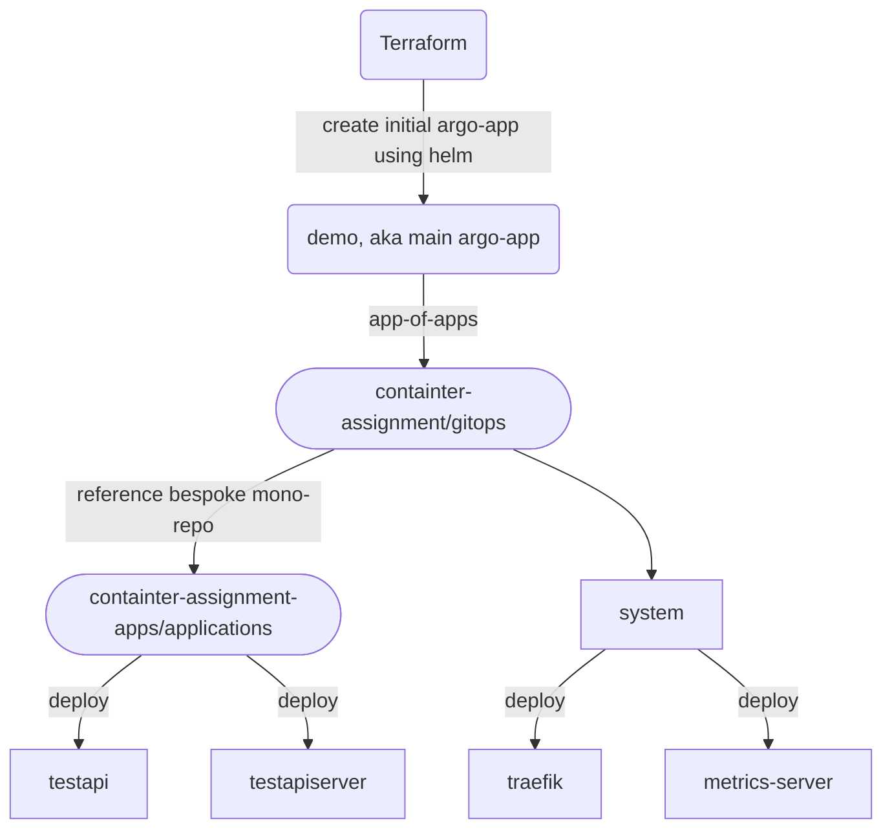

# GitOps Summary

Short and sweet about the top-level setup

  - Based on ArgoCD
  - Multiple levels of apps-of-apps
  - Uses official `argocd-apps` helm chart for deployment

Bootstrapping:

  - Initial `argocd-apps` helm chart is deployed using Terraform
    - Targets current git repository `./gitops` folder
  - Inside `./gitops` there is a helm chart with `argocd-apps` as a dependency
  - `values.yaml` in this folder contains next level of apps-of-apps
  - Bespoke applications (aka, internal microservices), is seperated into its own git repository for seperation of concerns.
  - Argoprojects is only used for filtering in ArgoCD UI
    - To be used with RBAC in a more feature complete implementation

Short flowchart for apps-of-apps flow:

