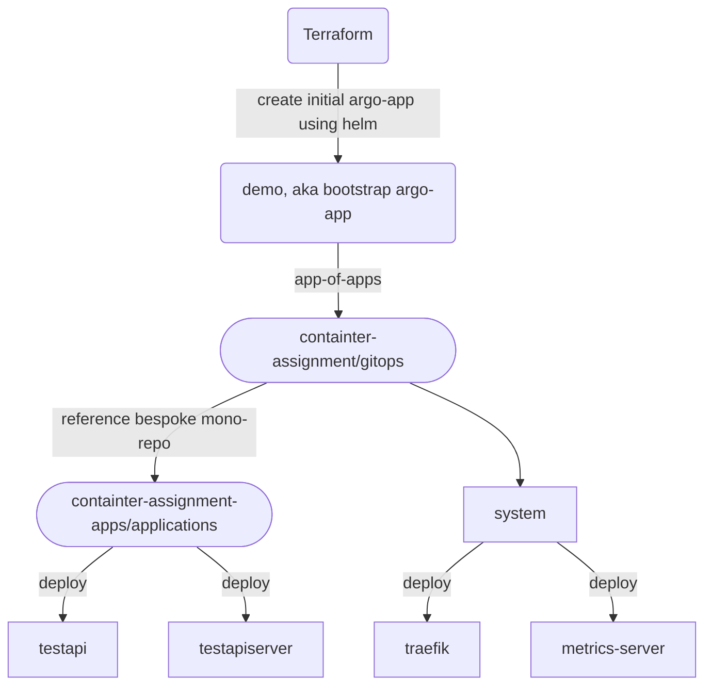

# GitOps Summary

Short and sweet about the top-level setup

  - Based on ArgoCD
  - Multiple levels of apps-of-apps
  - Uses official `argocd-apps` helm chart for deployment

### Bootstrapping

  - Initial `argocd-apps` helm chart is deployed using Terraform
    - Targets current git repository `./gitops` folder
  - Inside `./gitops` there is a helm chart with `argocd-apps` as a dependency
  - `values.yaml` in this folder contains next level of apps-of-apps
  - Bespoke applications (aka, internal microservices), is seperated into its own git repository for seperation of concerns.
  - Argoprojects is only used for filtering in ArgoCD UI
    - To be used with RBAC in a more feature complete implementation

Short flowchart for apps-of-apps flow:



### ArgoCD UI

There is no DNS for this demo, which ArgoCD kinda requires. So we will use port-forwarding with kubectl for reaching the frontend.

Port-forward to the service for argocd-server

```bash
kpf svc/argocd-server 8080:80
```

Should now be reachable at http://localhost:8080

Run this command to get the admin password

> remove pbcopy if you are not on MacOS, as this copies to clipboard

```bash
kubectl -n argocd get secret argocd-initial-admin-secret -o jsonpath="{.data.password}" | base64 -d | pbcopy
```

The username is `admin`, use the password which is now in your clipboard.
