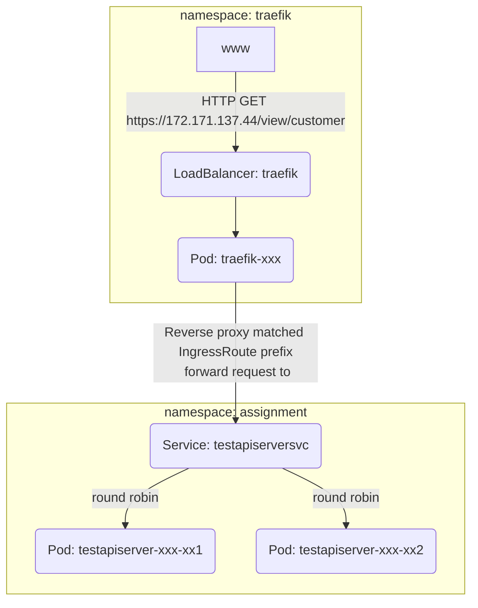

# Reverse Proxy Summary

For this demo I opted for Traefik

  - It's quick to get up and running
  - I have experience with maintaining Traefik
  - I also had plans to route argocd-ui and traefik dashboard, however scrapped due to time constraints
  - I only need one LoadBalancer for all traffic, and IPs are expensive nowadays

Simplified network flow diagram inside kubernetes

